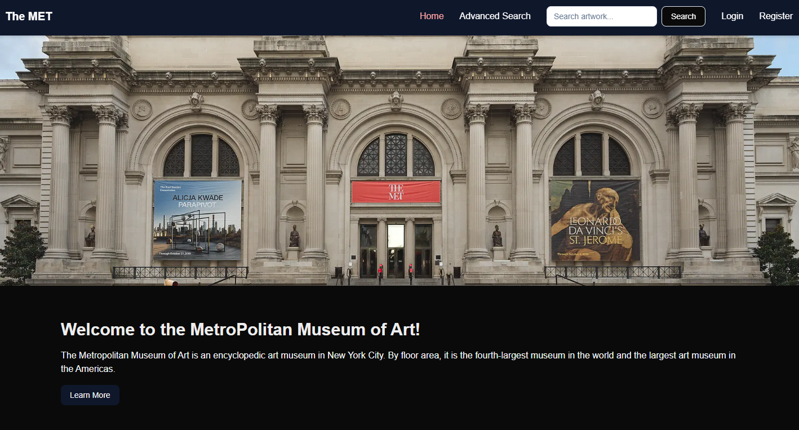

# The MET — Metropolitan Museum of Art Explorer

A Next.js web application for browsing and searching artwork from the [Metropolitan Museum of Art Collection API](https://metmuseum.github.io/).



## Features

- **Home page** — Introduction to The Met with a hero image and a link to learn more.
- **Quick search** — Search artwork by title directly from the navigation bar.
- **Advanced search** — Filter artwork by title, tags, geographic location, medium, on-view status, and highlight status.
- **Artwork gallery** — Paginated grid of results (12 per page) fetched from the Met Collection API.
- **Artwork detail page** — Full details for a single artwork including image, artist, date, classification, medium, credit line, and dimensions, with a link to the artist's Wikidata page.

## Tech Stack

| Technology | Purpose |
|---|---|
| [Next.js 16](https://nextjs.org) | React framework (Pages Router) |
| [React 19](https://react.dev) | UI library |
| [Tailwind CSS 4](https://tailwindcss.com) | Styling |
| [shadcn/ui](https://ui.shadcn.com) | UI component primitives (Radix UI) |
| [SWR](https://swr.vercel.app) | Data fetching and caching |
| [React Hook Form](https://react-hook-form.com) | Advanced search form handling |
| [Met Collection API](https://metmuseum.github.io/) | Artwork data source |

## Getting Started

Install dependencies:

```bash
npm install
```

Run the development server:

```bash
npm run dev
```

Open [http://localhost:3000](http://localhost:3000) in your browser.

## Project Structure

```
pages/
  index.jsx           # Home page
  search.jsx          # Advanced search form
  artwork/
    index.jsx         # Paginated artwork results grid
    [objectId].jsx    # Individual artwork detail page
components/
  Hero.jsx            # Hero image banner
  MainNav.jsx         # Top navigation with quick search
  ArtworkCard.jsx     # Artwork thumbnail card
  ArtworkCardDetail.jsx # Full artwork detail card
  ArtworkPagination.jsx # Pagination controls
  ui/                 # shadcn/ui components
```

## Available Scripts

| Script | Description |
|---|---|
| `npm run dev` | Start the development server |
| `npm run build` | Build for production |
| `npm run start` | Start the production server |
| `npm run lint` | Run ESLint |

